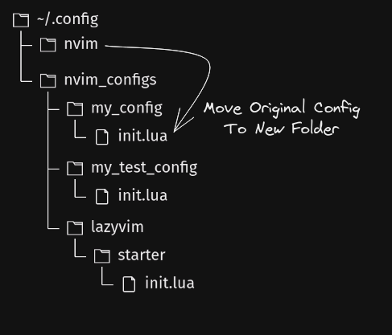

# ncm-rs

Neovim Configuration Manager (Store/Change/Swap Configurations)


I created this package because I wanted to try out Lazyvim (which is why it is referencec a few times) and other similar configuration packages and plugins without having to manually move my configuration files each time. I also wanted to be able to easily switch between configurations.

> **Note**
> Tests have been added. Though, this is still to be considered a WIP.

### Notable Features (so far)

---

- Add multiple configurations
- Conveniently switch between said configs


### Install Notes

---

> **Warning** 
> Make a backup!

### Make a backup of your current configuration. Always better to be safe than sorry.

To use this package, first backup your current configuration. If requested, automatic backup and movement of the original configuration could be added in the future. Unless/until that happens, you will need to move your configuration manually.

> **Note** 
> For the time being this package uses a symlink to swap/change which confuration Neovim will load.

When you select a configuration using the load option, it will be symlinked to the `~/.config/nvim` directory.




### Install
---

1. `sudo apt install just` (or equivalent for your distro)
2. `git clone https://github.com/instance.id/ncm-rs.git`
3. `cd ncm-rs`
4. `just install` (installs to `~/.local/bin/ncm`)

---
### Example Usage


Add a new configuration

```bash
ncm add <name> <path> <description (optional)>
```

#### Load a configuration
(Once a configuration is loaded, you can use your normal `$ nvim` commands or custom keybindings as ususal)

```bash
ncm load <name>
```

#### List current configurations

```bash
ncm list
```

#### Remove a configuration

```bash
ncm remove <name>
```

### Demonstration

---

https://user-images.githubusercontent.com/48368821/218245017-c2dda78f-7807-49f8-a44a-ad42d280d299.mp4


### Tests

---

Tests are located in configs.rs and are automatically run when using `just install` but can be run using `just test` or `cargo test` 

---
