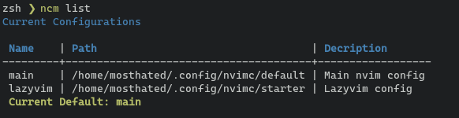

# ncm-rs

Neovim Configuration Manager (Swap/Backup/Try Configurations Easily)



I created this package because I wanted to try out Lazyvim (which is why it is referenced a few times) and other similar configuration packages and plugins without having to manually move my configuration files each time. I also wanted to be able to easily switch between configurations.

> **Note**
> Tests have been added. Though, this is still to be considered a WIP. Currently Linux and Windows only.

### Notable Features (so far)

---

- Add multiple configurations
- Conveniently switch between said configs
- Automatic initial backup
- Backup selected/all configurations (demonstrated below)


### Install Notes

---

> **Warning** 
> Make a backup of your current configuration. While NCM will backup your configuration for you, always better to be safe than sorry.

This package uses a file system symlink to swap/change which configuration Neovim will load.
When you select a configuration using the load option, it will be symlinked to the `~/.config/nvim` directory.

> **Note**
> An automated backup and setup process has been added.

### Install
---
    
1. `sudo apt install just` (or equivalent for your distro)
2. `git clone https://github.com/instance.id/ncm-rs.git`
3. `cd ncm-rs`
4. `just install` (installs to `~/.local/bin/ncm` (might need to be added to $PATH on Windows))

---
### Example Usage


Add a new configuration

```bash
ncm add <name> <path> <description (optional)>
```

#### Load a configuration
(Once a configuration is loaded, you can use your normal `$ nvim` commands or custom keybindings as ususal)

```bash
ncm load <name>
```

#### List current configurations

```bash
ncm list
```

#### Remove a configuration

```bash
ncm remove <name>
```

#### Backup current configuration

```bash
ncm backup <name (optional)> 
```


### Tests

---

Tests are currently located in `configs.rs` and `settings.rs` (more to come) and are automatically run when using `just install` but can be run using `just test` or `cargo test` 

---

